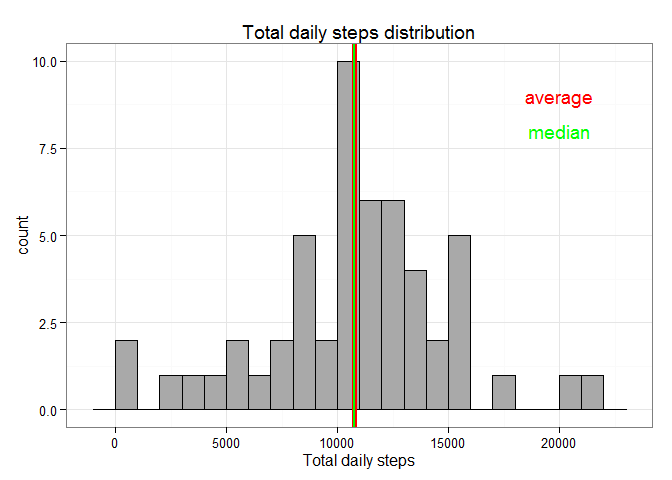
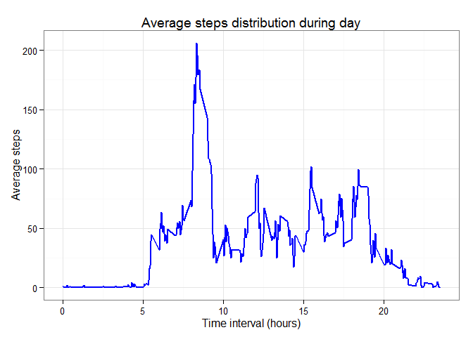
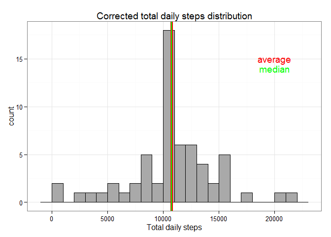
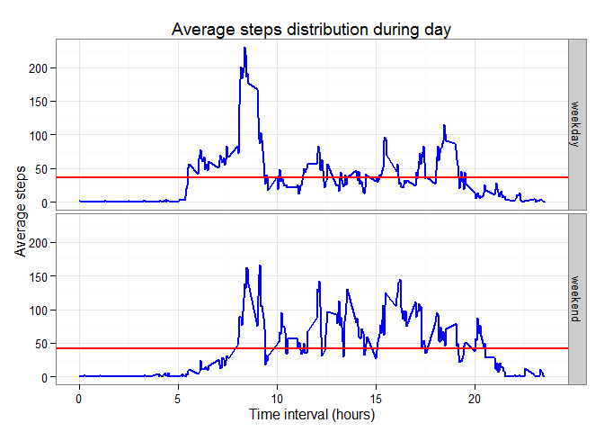

# Reproducible Research: Peer Assessment 1

This assignment used data from a personal activity monitoring device. 
This device collects data at 5 minute intervals through out the day. 
The data consists of two months of data from an anonymous individual collected 
during the months of October and November, 2012 and include the number of steps 
taken in 5 minute intervals each day.

### Loading and preprocessing the data
Data loaded from csv-file and variable "date" converted to date format. 

```r
srcdata <- read.csv("activity.csv", stringsAsFactors = F)
srcdata$date <- as.Date(srcdata$date,"%Y-%m-%d")
```

### What is mean total number of steps taken per day?
Created new dataset with steps, aggregated  by days, calculated average and median 
steps by day.


```r
databydays <- aggregate(steps ~ date, data = srcdata, sum)
med <- median(databydays$steps) 
avg <- as.integer(round(mean(databydays$steps)))
```

Average steps by day **10766** and median **10765** are very close. 

Total daily steps distribution presented at the plot below.

```r
library(ggplot2)

h1 <- ggplot(data=databydays, aes(steps)) + theme_bw() + 
        geom_histogram( colour="black", fill = "darkgray", binwidth = 1000) + 
        labs(title = "Total daily steps distribution", x = "Total daily steps")
h1 <- h1 + geom_vline(xintercept=avg, color="red", size=2) + 
        annotate("text", x = 20000, y = 9, label = "average", color="red") + 
        geom_vline(xintercept=med, color="green", size=1) + 
        annotate("text", x = 20000, y = 8, label = "median", color="green")
h1
```

 


### What is the average daily activity pattern?

New dataset was created with steps, averaged by each time interval during the day. 
You can see it at the plot.


```r
databyint <- aggregate(steps ~ interval, data = srcdata, mean)
maxsteps <- round(max(databyint$steps))
maxint <- databyint$interval[databyint$steps==max(databyint$steps)]

h2 <- ggplot(data=databyint, aes(x=interval/100, y=steps)) + theme_bw() + 
        geom_line(color = "blue", size=1) + 
        labs(title = "Average steps distribution during day", 
              x = "Time interval (hours)",  y = "Average steps")
h2
```

 

The time interval with maximum activity (maximum average steps **206**) was 
**8:35**.


### Imputing missing values

The source contains **2304** rows with steps=NA. 
It's **13.1 %** of all data.  
We can fill these missing data by average steps for each specific time interval.
We created dataset "databyint" before and can use it for new dataset creation.


```r
corrdata <- srcdata
corrdata$steps <- as.numeric(apply(srcdata,1,function(x) 
        if (is.na(x[1])) {round(databyint[databyint[1]==as.numeric(x[3]),2])} else {x[1]}))

databydays_corr <- aggregate(steps ~ date, data = corrdata, sum)
med_corr <- as.integer(median(databydays_corr$steps)) 
avg_corr <- as.integer(round(mean(databydays_corr$steps)))

h3 <- ggplot(data=databydays_corr, aes(steps)) + theme_bw() + 
        geom_histogram( colour="black", fill = "darkgray", binwidth = 1000) + 
        labs(title = "Corrected total daily steps distribution", x = "Total daily steps")
h3 <- h3 + geom_vline(xintercept=avg_corr, color="red", size=2) + 
        annotate("text", x = 20000, y = 15, label = "average", color="red") + 
        geom_vline(xintercept=med_corr, color="green", size=1) + 
        annotate("text", x = 20000, y = 14, label = "median", color="green")
h3
```

 

The histogram show us that corrected data not very far from original, just more 
days now near average value. Average steps by day **10766** didn't change 
and median **10762** decreased only **3** steps by day. 


### Are there differences in activity patterns between weekdays and weekends?

We need split data by weekdays and weekend days. A new factor variable was created
with two levels – “weekday” and “weekend”. Splitted by new factor data on the plot below 


```r
cur_locale <- Sys.getlocale("LC_TIME")
tmp_locale <- Sys.setlocale("LC_TIME", "English") # switch to english weekday's names 

wdays <- factor(weekdays(srcdata$date) %in% c("Sunday", "Saturday"), labels = c("weekday","weekend"))

tmp_locale <- Sys.setlocale("LC_TIME", cur_locale) # switch to origin time locale 

corrdata <- cbind(corrdata, wdays)
databyint_corr <- aggregate(steps ~ wdays + interval , data = corrdata, mean)

avg_wd_int <- aggregate(steps ~ wdays , data = corrdata, mean)
avg_wd <- aggregate(steps ~ wdays, data = aggregate(steps ~ date + wdays , data = corrdata, sum), mean)

h4 <- ggplot(data=databyint_corr, aes(x=interval/100, y=steps)) + theme_bw() + 
        geom_line(color = "blue", size=1) +  
        geom_hline(data= avg_wd_int, aes(yintercept=steps), color="red", size=1) + 
        facet_grid(wdays ~. ) +
        labs(title = "Average steps distribution during day", 
             x = "Time interval (hours)",  y = "Average steps")
h4
```

 

Weekdays activity has large peak at the morning and low number of steps during other time. 
But total average activity at weekend is higher (see table below). 


```r
avg_wd  
```

```
##     wdays    steps
## 1 weekday 10255.29
## 2 weekend 12201.00
```
